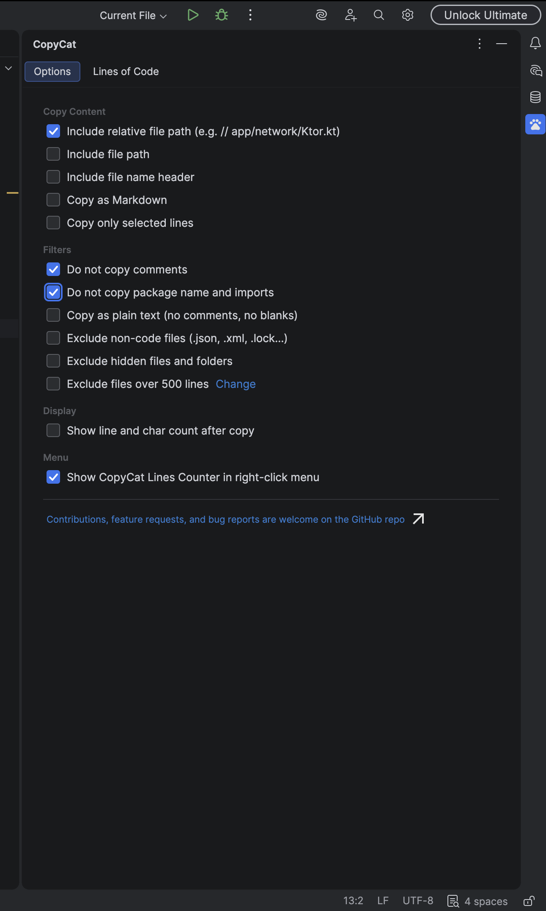
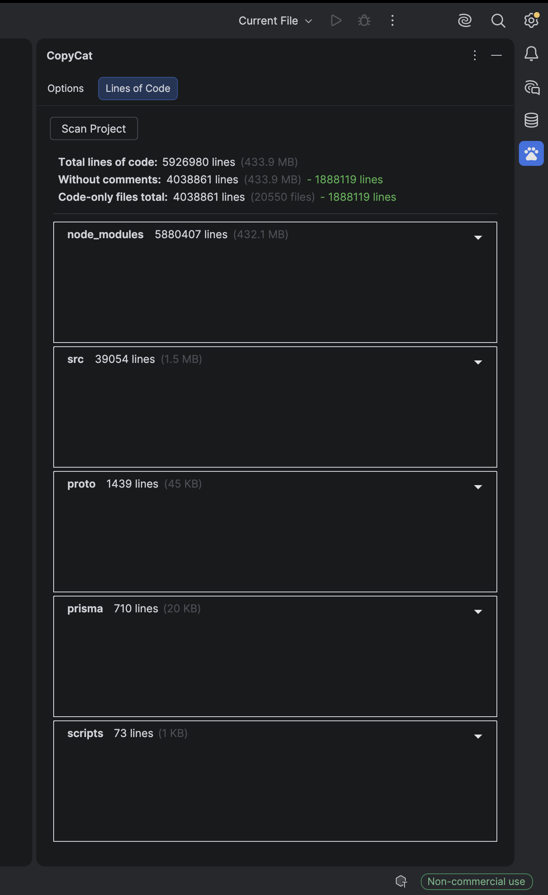
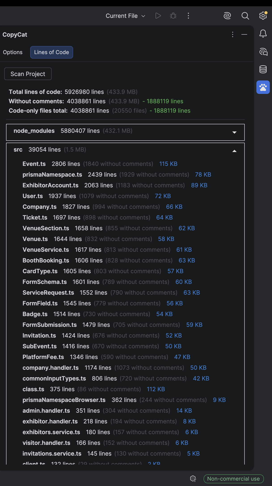
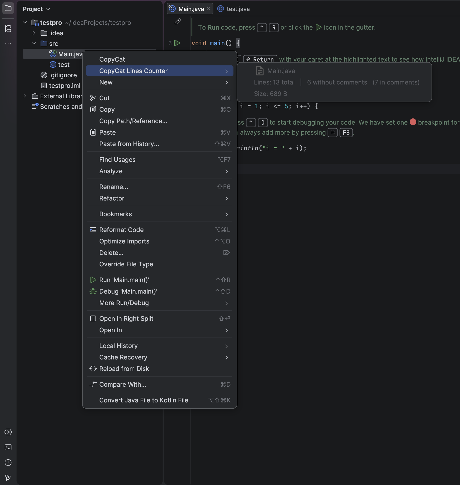

  

<h1 align="center">CopyCat — JetBrains Plugin</h1>

  A fast, configurable plugin to copy file and folder contents from the project tree across all JetBrains IDEs.

 
 

CopyCat is a JetBrains IDE plugin that adds a fast, configurable way to copy file and folder contents directly from the project file tree. It supports recursive folder copying, code formatting, and a built-in Lines of Code analyzer.

Compatible with all JetBrains IDEs: IntelliJ IDEA, RustRover, PyCharm, WebStorm, GoLand, Rider, CLion, DataGrip, and all others.

  <a href="https://plugins.jetbrains.com/plugin/31777" style="display: inline-flex; align-items: center; gap: 4px; text-decoration: none;">
    
    Get Plugin
  </a>

---

## Features

### Copy Content
Right-click any file or folder in the project tree and select **CopyCat** to copy its contents to the clipboard. For folders, it recursively copies all files inside, including nested subdirectories.

### Copy Options
A dedicated settings panel (accessible via the CopyCat tool window in the sidebar) lets you configure how content is copied:

**Content**
- Include the full file path as a header above each file
- Include the file name as a header above each file
- Copy content wrapped in Markdown code blocks with language detection
- Copy only the lines currently selected in the editor

**Filters**
- Strip all comments before copying
- Strip package declarations and import statements
- Copy as plain text (removes comments, blank lines, and imports)
- Exclude non-code files such as `.json`, `.xml`, `.lock`, `.yml`, and others
- Exclude hidden files and folders
- Exclude files over a configurable line threshold (default: 500 lines)

**Display**
- Show total line and character count in the status bar after each copy

**Menu**
- Toggle the CopyCat Lines Counter submenu on or off in the right-click menu

### Lines of Code Analyzer
The CopyCat tool window includes a Lines of Code tab. Click **Scan Project** to analyze the entire project and see:

- Total lines of code and project size
- Total lines excluding comments and the difference
- Total lines across code-only files and the difference
- A breakdown by folder, expandable to show individual files with line counts, comment-stripped counts, and file sizes

### CopyCat Lines Counter (Right-Click Menu)
Right-clicking a file or folder also shows a **CopyCat Lines Counter** submenu with an instant compact summary:

- File or folder name
- Total lines and lines without comments
- File count (for folders) and size

---

## Installation

### From JetBrains Marketplace
1. Open your JetBrains IDE
2. Go to **Settings → Plugins → Marketplace**
3. Search for **CopyCat**
4. Click **Install**

### Manual Installation
1. Download the latest `.zip` from the [Releases](https://github.com/sam-a1a/JetbrainsCopyCat/releases) page
2. Open your JetBrains IDE
3. Go to **Settings → Plugins → gear icon → Install Plugin from Disk**
4. Select the downloaded `.zip` file
5. Restart the IDE

---

## Screenshots

### Settings Panel

### Lines of Code Analyzer

### Right-Click Menu

---

## Usage

1. Open any project in a JetBrains IDE
2. Right-click any file or folder in the **Project** panel
3. Click **CopyCat** to copy the content to your clipboard
4. To configure behavior, open the **CopyCat** panel from the right sidebar
5. To view line statistics, open the **CopyCat** panel and go to the **Lines of Code** tab

---

## Contributing

Contributions, feature requests, and bug reports are welcome. Please open an issue or submit a pull request on this repository.

---

## License

This project is licensed under the MIT License.